<div align="center">
  
</div>

---

Quick reference for SOC analysts, incident responders, and threat hunters. Covers common protocols with ATT&CK mappings, detection indicators, Windows Event IDs, network signatures, and remediation priorities.

Built for the shift — open it, find what you need, act.

---

## Contents

- [Legend](#legend)
- [Web, Naming & Core Infrastructure](#web-naming--core-infrastructure)
- [File Transfer & Sharing](#file-transfer--sharing)
- [Email](#email)
- [Remote Access & Management](#remote-access--management)
- [Authentication & Directory](#authentication--directory)
- [Infrastructure & Other](#infrastructure--other)
- [Detection Quick Reference](#detection-quick-reference)
- [Windows Event ID Cheatsheet](#windows-event-id-cheatsheet)
- [Contributing](#contributing)

---

## Legend

- **Port(s):** `port/protocol`
- **Use:** Legitimate purpose
- **Sev:** Low / Medium / Critical — typical severity when abused
- **Risk:** Threat description + MITRE ATT&CK reference
- **Monitor (Net/Log/Endpt):** Key indicators and anomalies to watch
- **Fix:** Prioritized remediation steps

---

## Web, Naming & Core Infrastructure

### [HTTP](https://developer.mozilla.org/en-US/docs/Web/HTTP/Overview)
**Port:** `80/TCP` | **Use:** Web | **Sev:** Medium
**Risk:** [[TA0006]](https://attack.mitre.org/tactics/TA0006/) Credentials and session cookies transmitted in plaintext.
**Monitor:** HTTP to auth pages, `POST` requests with sensitive keywords (`password`, `login`), unusual or rare User-Agent strings.
**Fix:** 1. Enforce HTTPS (HSTS) | 2. Alert on sensitive `POST` over plaintext.

---

### [HTTPS (TLS/SSL)](https://developer.mozilla.org/en-US/docs/Web/Security/Transport_Layer_Security)
**Port:** `443/TCP` (+ `UDP` QUIC) | **Use:** Encrypted web | **Sev:** Medium
**Risk:** [[TA0011]](https://attack.mitre.org/tactics/TA0011/) C2 and phishing hidden in encrypted traffic `[T1571]` `[T1573]`
**Monitor:** Invalid/self-signed/anomalous Let's Encrypt certs (DV), unusual JA3/S hashes, typosquatted or DGA-like SNI domains, abnormal volume or timing, unexpected QUIC (`UDP 443`).
**Fix:** 1. TLS inspection where feasible | 2. DNS/web filtering | 3. Block weak cipher suites and deprecated TLS versions.

---

### [DNS](https://datatracker.ietf.org/doc/html/rfc1034)
**Port:** `53/UDP,TCP` | **Use:** Name resolution | **Sev:** Critical
**Risk:** [[TA0011]](https://attack.mitre.org/tactics/TA0011/) C2 via tunneling `[T1572]` and DGA `[T1568]`; [[TA0007]](https://attack.mitre.org/tactics/TA0007/) Reconnaissance
**Monitor:** Queries to malicious, newly registered, or rare domains/TLDs; high `NXDOMAIN` rate; anomalous query size, entropy, or type (`ANY/TXT/NULL`); `TCP 53` traffic (zone transfers or tunneling); DNS beaconing patterns.
**Fix:** 1. DNS filtering (RPZ/blocking) | 2. Alert on volume and query type anomalies | 3. Restrict internal recursive resolvers.

---

### [ICMP](https://datatracker.ietf.org/doc/html/rfc792)
**Port:** `IP Proto 1` | **Use:** IP control and error messaging | **Sev:** Medium
**Risk:** [[TA0007]](https://attack.mitre.org/tactics/TA0007/) Ping sweeps `[T1018]` and traceroute; [[TA0011]](https://attack.mitre.org/tactics/TA0011/) Tunneling for C2/exfil `[T1095]`
**Monitor:** Sweeps (`icmp.type == 8` above threshold), blocked types/codes (`icmp.type == 3`), tunneling patterns (payload size, frequency), redirects (`icmp.type == 5`), timestamp requests/replies (`icmp.type == 13/14`).
**Fix:** 1. Filter ICMP at perimeter (allow only required types) | 2. Monitor for tunneling patterns | 3. Rate-limit.

---

## File Transfer & Sharing

### [FTP](https://datatracker.ietf.org/doc/html/rfc959)
**Port:** `21,20/TCP` (+ passive ports >1024) | **Use:** File transfer | **Sev:** Medium
**Risk:** [[TA0006]](https://attack.mitre.org/tactics/TA0006/) Credentials and data in plaintext; [[TA0010]](https://attack.mitre.org/tactics/TA0010/) Exfiltration
**Monitor:** Not recommended for use. Any unexpected or external traffic. Anonymous auth attempts (`USER anonymous`).
**Fix:** 1. Migrate to SFTP or FTPS | 2. Disable or severely restrict | 3. Review FTP server logs.

---

### [TFTP](https://datatracker.ietf.org/doc/html/rfc1350)
**Port:** `69/UDP` | **Use:** Simple file transfer (no auth) | **Sev:** Medium
**Risk:** `[T1037.005]` Internal malware staging/exfil; [[TA0007]](https://attack.mitre.org/tactics/TA0007/) Reconnaissance
**Monitor:** Any unexpected traffic is suspicious. `udp.port == 69`. Write requests (`WRQ`) especially.
**Fix:** 1. Disable if not essential | 2. Restrict by IP/VLAN | 3. Monitor.

---

### [SMB](https://learn.microsoft.com/en-us/windows/win32/fileio/microsoft-smb-protocol-and-cifs-protocol-overview)
**Port:** `445/TCP` (legacy `139/TCP`) | **Use:** Windows file/print/IPC | **Sev:** Critical
**Risk:** [[TA0008]](https://attack.mitre.org/tactics/TA0008/) Lateral movement via PtH `[T1550.002]`, exploits `[T1210]`, PsExec `[T1021.002]`; [[TA0006]](https://attack.mitre.org/tactics/TA0006/) Credential theft via relay `[T1557.001]` and hash capture `[T1552.004]`; [[TA0010]](https://attack.mitre.org/tactics/TA0010/) Exfiltration `[T1030]`
**Monitor (Net):** Workstation-to-workstation connections with unusual patterns or timing; SMBv1 traffic; any SMB to/from the internet (block).
**Monitor (Logs):** `4624(3)` with anomalous source/dest/user/time/workstation name; `4625` failures above threshold; `5140/5145` admin share access and writes; `7045` PsExec service installs; `4688` for `psexec.exe`/`rundll32`.
**Fix:** 1. Disable SMBv1 | 2. Network segmentation | 3. Enforce SMB signing | 4. Restrict admin share access and use LAPS.

---

### [NFS](https://datatracker.ietf.org/doc/html/rfc7530) (v4)
**Port:** `2049/TCP,UDP` (+ RPC `111`) | **Use:** Unix/Linux file sharing | **Sev:** Medium
**Risk:** `[T1059.004]` Insecure exports (`*`, `no_root_squash`); [[TA0010]](https://attack.mitre.org/tactics/TA0010/) Exfiltration; [[TA0008]](https://attack.mitre.org/tactics/TA0008/) Lateral movement
**Monitor:** Access from unauthorized IPs, wildcard exports, `no_root_squash` in use, NFS traffic to/from the internet. Mount logs.
**Fix:** 1. Use NFSv4 with Kerberos (`sec=krb5p`) | 2. Apply least privilege to exports | 3. Firewall NFS ports.

---

### [SFTP (over SSH)](https://datatracker.ietf.org/doc/html/rfc4253)
**Port:** `22/TCP` | **Use:** Secure file transfer | **Sev:** Medium
**Risk:** [[TA0010]](https://attack.mitre.org/tactics/TA0010/) Encrypted exfiltration; malware upload
**Monitor:** See SSH. Anomalous transfer volume or frequency.
**Fix:** See SSH. Alert on unusual transfer volumes.

---

## Email

### [SMTP](https://datatracker.ietf.org/doc/html/rfc5321)
**Port:** `25/TCP` (server), `587/TCP` (STARTTLS submission), `465/TCP` (legacy SMTPS) | **Use:** Email delivery | **Sev:** Critical
**Risk:** `[T1566]` Phishing and malware delivery; `[T1071.003]` C2 via email; `[T1534]` Internal spearphishing; open relay abuse
**Monitor:** Outbound volume above baseline; unusual external MX connections; SPF/DKIM/DMARC failures; anomalous internal relaying; suspicious headers.
**Fix:** 1. Implement SPF, DKIM, and DMARC | 2. Anti-spam/malware gateway | 3. Close open relays | 4. Require STARTTLS or SMTPS.

---

### [IMAP](https://datatracker.ietf.org/doc/html/rfc3501)
**Port:** `143/TCP`, `993/TCP` (IMAPS) | **Use:** Mailbox access | **Sev:** Medium
**Risk:** `[T1114]` Mailbox access; `[T1078]` Brute force; plaintext credentials over `143/TCP`
**Monitor:** Login failures above threshold; access from unusual IPs or User-Agents; any use of `143/TCP`. Mail server logs.
**Fix:** 1. Use IMAPS (`993`) | 2. Enforce MFA | 3. Monitor access logs.

---

### [POP3](https://datatracker.ietf.org/doc/html/rfc1939)
**Port:** `110/TCP`, `995/TCP` (POP3S) | **Use:** Email download | **Sev:** Low
**Risk:** [[TA0006]](https://attack.mitre.org/tactics/TA0006/) Plaintext credentials over `110/TCP`
**Monitor:** Any use of `110/TCP`.
**Fix:** 1. Use POP3S (`995`) or IMAPS | 2. Disable if unused.

---

## Remote Access & Management

### [SSH](https://datatracker.ietf.org/doc/html/rfc4251)
**Port:** `22/TCP` | **Use:** Secure shell, tunneling, SFTP | **Sev:** Critical
**Risk:** `[T1078]` Brute force, stolen credentials or keys; `[T1090]` Proxying and C2 tunneling `[T1572]`; `[T1021.004]` Lateral movement
**Monitor:** Login failures above threshold; logins from unusual IPs or geolocations; persistent connections or activity outside business hours; tunnel flags in process args (`ssh -L/-R`); modifications to `authorized_keys`; `scp`/`sftp` usage. Auth logs (`/var/log/auth.log`).
**Fix:** 1. Disable password auth (use keys only) | 2. Enforce MFA | 3. Deploy Fail2Ban or SSHGuard | 4. Use jump hosts | 5. Monitor SSH logs.

---

### [Telnet](https://datatracker.ietf.org/doc/html/rfc854)
**Port:** `23/TCP` | **Use:** Legacy CLI (obsolete) | **Sev:** Low
**Risk:** [[TA0006]](https://attack.mitre.org/tactics/TA0006/) Everything transmitted in plaintext — no exceptions
**Monitor:** Any use is suspicious. `tcp.port == 23`.
**Fix:** 1. Disable | 2. Replace with SSH.

---

### [RDP](https://learn.microsoft.com/en-us/windows/win32/termserv/remote-desktop-protocol)
**Port:** `3389/TCP,UDP` | **Use:** Windows remote desktop | **Sev:** Critical
**Risk:** `[T1078]` Brute force; `[T1021.001]` Lateral movement; `[T1567]` Clipboard exfil; `[T1219]` Exploits (BlueKeep)
**Monitor (Net):** RDP to/from the internet (block); internal workstation-to-workstation or unusual connections.
**Monitor (Logs):** `4624(10)` with anomalous source/user/time; `4625` failures above threshold; `4634/4647` logoff with anomalous session duration; RDP Operational logs.
**Fix:** 1. Never expose RDP directly to the internet — use VPN or RD Gateway with MFA | 2. Require NLA | 3. Strong passwords and LAPS | 4. Restricted Admin Mode or Remote Credential Guard.

---

### [SNMP](https://datatracker.ietf.org/doc/html/rfc3411) (v3)
**Port:** `161/UDP` (queries), `162/UDP` (traps) | **Use:** Network monitoring | **Sev:** Low
**Risk:** [[TA0007]](https://attack.mitre.org/tactics/TA0007/) Reconnaissance via v1/v2c with default community strings; DDoS amplification
**Monitor:** v1/v2c queries from external or unexpected sources; weak community strings (`public`, `private`). `snmp.version != 3`.
**Fix:** 1. Use SNMPv3 (AuthPriv) | 2. ACLs on devices | 3. Change default community strings.

---

## Authentication & Directory

### [LDAP](https://datatracker.ietf.org/doc/html/rfc4511)
**Port:** `389/TCP,UDP`, `636/TCP` (LDAPS) | **Use:** Directory access (AD) | **Sev:** Critical
**Risk:** [[TA0007]](https://attack.mitre.org/tactics/TA0007/) Reconnaissance via anonymous bind `[T1087.002]`; `[T1078]` Brute force and plaintext creds over `389`; `[T1003.006]` DCSync
**Monitor:** Anonymous binds; bind failures above threshold; large or targeted queries (`samaccountname=*`); plaintext `389` traffic. AD logs: `4662` with relevant GUIDs; `1644` for expensive queries on DCs.
**Fix:** 1. Require LDAPS (`636`) | 2. Disable anonymous bind | 3. Enforce LDAP signing and channel binding | 4. Audit directory service access.

---

### [Kerberos](https://datatracker.ietf.org/doc/html/rfc4120)
**Port:** `88/TCP,UDP` | **Use:** AD authentication | **Sev:** Critical
**Risk:** `[T1558.003]` Kerberoasting; `[T1558.002]` Pass-the-Ticket; `[T1558.001]` Golden/Silver Ticket
**Monitor:** `4768` (TGT — anomalous source/user); `4769` (TGS — anomalous SPN, RC4 cipher, or high volume); `4771` (pre-auth failures); RC4_HMAC_MD5 cipher usage.
**Fix:** 1. Strong passwords on service accounts | 2. Monitor `4768/4769/4771` | 3. Disable RC4 | 4. Add sensitive accounts to Protected Users group.

---

### [RADIUS](https://datatracker.ietf.org/doc/html/rfc2865)
**Port:** `1812,1813/UDP` | **Use:** AAA for VPN and Wi-Fi | **Sev:** Medium
**Risk:** `[T1078]` Weak shared secrets or brute force; credential sniffing without secure EAP
**Monitor:** Auth failures above threshold; requests from unauthorized NAS; insecure EAP methods in use. AAA server logs.
**Fix:** 1. Strong unique shared secrets or certificates | 2. Require EAP-TLS | 3. Monitor RADIUS logs.

---

## Infrastructure & Other

### [DHCP](https://datatracker.ietf.org/doc/html/rfc2131)
**Port:** `67/UDP` (server), `68/UDP` (client) | **Use:** Automatic IP assignment | **Sev:** Medium
**Risk:** `[T1557.003]` Rogue DHCP (MitM); DHCP starvation (DoS)
**Monitor:** Multiple DHCP offers on same segment (DHCP snooping logs); pool exhaustion; anomalous DHCP options (WPAD, rogue DNS server).
**Fix:** 1. DHCP snooping on switches | 2. Port security | 3. Monitor DHCP server logs.

---

### [NTP](https://datatracker.ietf.org/doc/html/rfc5905)
**Port:** `123/UDP` | **Use:** Clock synchronization | **Sev:** Low
**Risk:** DDoS amplification; time manipulation attacks
**Monitor:** NTP traffic to/from unauthorized external sources; large `readvar` responses; clock skew above threshold.
**Fix:** 1. Use internal or authorized NTP sources | 2. NTP authentication where supported | 3. Monitor sync health.

---

### [Syslog](https://datatracker.ietf.org/doc/html/rfc5424)
**Port:** `514/UDP` (legacy), `514/TCP`, `6514/TCP` (TLS) | **Use:** Log forwarding | **Sev:** Low
**Risk:** [[TA0009]](https://attack.mitre.org/tactics/TA0009/) Log loss over UDP; sniffing or tampering without TLS
**Monitor:** Gaps in log streams; volume spikes; unexpected sources; use of `514/UDP` instead of `6514/TCP`.
**Fix:** 1. Use Syslog over TLS (`6514`) | 2. Monitor collector health | 3. Verify receipt of critical log sources.

---

## Detection Quick Reference

Network-level detections for the most abused protocols. All filters are Wireshark display filter syntax unless noted.

**SMB — lateral movement hunting**
```
# Workstation to workstation SMB (not expected in normal traffic)
smb && ip.src != <DC_IP> && ip.dst != <DC_IP>

# SMBv1 usage (should be zero)
smb.header.cmd && smb2 == 0

# Admin share access patterns
tcp.port == 445 && smb2.filename contains "ADMIN$"
tcp.port == 445 && smb2.filename contains "C$"
tcp.port == 445 && smb2.filename contains "IPC$"
```

**RDP — brute force and lateral**
```
# External RDP (block all of this)
tcp.dstport == 3389 && ip.src not in {10.0.0.0/8 172.16.0.0/12 192.168.0.0/16}

# RDP from unexpected internal sources
tcp.dstport == 3389 && ip.src != <known_jump_hosts>
```

**DNS — C2 and tunneling**
```
# High entropy domain names (manual review)
dns && frame.len > 100

# TXT queries (common in DNS tunneling)
dns.qry.type == 16

# High NXDOMAIN rate from a single source
dns.flags.rcode == 3

# DNS over TCP (excluding zone transfers)
tcp.port == 53 && ip.src not in {<DC_IPs>}
```

**Kerberos — attack signatures**
```
# RC4 cipher in TGS-REQ (Kerberoasting indicator)
kerberos.etype == 23

# AS-REP roasting (pre-auth not required)
kerberos.msg_type == 11 && kerberos.etype == 23

# Unusual TGT requests (Golden Ticket — anomalous source)
kerberos.msg_type == 10
```

**SSH — brute force and tunneling**
```bash
# Brute force detection in auth.log (Linux)
grep "Failed password" /var/log/auth.log | awk '{print $11}' | sort | uniq -c | sort -rn | head -20

# Detect SSH tunnel flags in process list
ps aux | grep -E "ssh.*(-L|-R|-D)" | grep -v grep

# Check for new authorized_keys modifications
find /home -name "authorized_keys" -newer /etc/passwd 2>/dev/null
find /root/.ssh -name "authorized_keys" -newer /etc/passwd 2>/dev/null
```

**LDAP — reconnaissance detection**
```bash
# Large LDAP queries on a DC (Windows Event 1644 must be enabled)
# Enable: reg add "HKLM\SYSTEM\CurrentControlSet\Services\NTDS\Diagnostics" /v "15 Field Engineering" /t REG_DWORD /d 5

# PowerShell: find expensive LDAP queries
Get-WinEvent -LogName "Directory Service" | Where-Object {$_.Id -eq 1644}
```

---

## Windows Event ID Cheatsheet

Consolidated reference for the most detection-relevant Event IDs. Organized by attack category.

**Authentication**

| Event ID | Channel | Description | ATT&CK |
|----------|---------|-------------|--------|
| 4624 | Security | Successful logon — check Logon Type (2=interactive, 3=network, 10=remote) | T1078 |
| 4625 | Security | Failed logon — volume threshold indicates brute force | T1110 |
| 4634 | Security | Logoff | T1078 |
| 4647 | Security | User-initiated logoff | T1078 |
| 4648 | Security | Logon with explicit credentials (RunAs, PtH indicator) | T1550.002 |
| 4768 | Security | Kerberos TGT request | T1558 |
| 4769 | Security | Kerberos TGS request — RC4 cipher = Kerberoasting | T1558.003 |
| 4771 | Security | Kerberos pre-auth failure | T1110 |
| 4776 | Security | NTLM authentication — monitor for unusual sources | T1550.002 |

**Process & Execution**

| Event ID | Channel | Description | ATT&CK |
|----------|---------|-------------|--------|
| 4688 | Security | Process creation — requires audit policy + command line logging | T1059 |
| 4689 | Security | Process termination | — |
| 1 | Sysmon | Process creation — includes hash, parent, command line | T1059 |
| 3 | Sysmon | Network connection initiated by process | T1071 |
| 7 | Sysmon | Image/DLL loaded | T1574 |
| 8 | Sysmon | CreateRemoteThread — process injection indicator | T1055 |
| 10 | Sysmon | ProcessAccess — LSASS access = credential dumping | T1003 |

**Privilege & Account Changes**

| Event ID | Channel | Description | ATT&CK |
|----------|---------|-------------|--------|
| 4720 | Security | User account created | T1136 |
| 4722 | Security | User account enabled | T1098 |
| 4724 | Security | Password reset attempt | T1098 |
| 4728 | Security | Member added to security-enabled global group | T1069 |
| 4732 | Security | Member added to local security group | T1069 |
| 4756 | Security | Member added to universal security group | T1069 |

**Lateral Movement & Remote Access**

| Event ID | Channel | Description | ATT&CK |
|----------|---------|-------------|--------|
| 5140 | Security | Network share accessed | T1021.002 |
| 5145 | Security | Network share object access check | T1021.002 |
| 7045 | System | Service installed — PsExec drops a service | T1021.002 |
| 4698 | Security | Scheduled task created | T1053.005 |
| 4702 | Security | Scheduled task updated | T1053.005 |

**Persistence**

| Event ID | Channel | Description | ATT&CK |
|----------|---------|-------------|--------|
| 11 | Sysmon | File created | T1105 |
| 12/13/14 | Sysmon | Registry created/modified/deleted | T1547 |
| 22 | Sysmon | DNS query | T1071.004 |
| 23 | Sysmon | File deleted | T1070 |

**PowerShell / Script Execution**

| Event ID | Channel | Description | ATT&CK |
|----------|---------|-------------|--------|
| 4103 | PS Operational | Module logging — command invocation | T1059.001 |
| 4104 | PS Script Block | Script block logging — full script content | T1059.001 |
| 400 | PS Engine | PowerShell engine started | T1059.001 |
| 800 | PS Engine | Pipeline execution | T1059.001 |

```powershell
# Enable critical audit policies (run as admin)
auditpol /set /subcategory:"Logon" /success:enable /failure:enable
auditpol /set /subcategory:"Process Creation" /success:enable
auditpol /set /subcategory:"Kerberos Service Ticket Operations" /success:enable /failure:enable

# Enable command line in process creation (4688)
reg add "HKLM\SOFTWARE\Microsoft\Windows\CurrentVersion\Policies\System\Audit" /v ProcessCreationIncludeCmdLine_Enabled /t REG_DWORD /d 1

# Check current audit policy
auditpol /get /category:*
```

---

*Quick reference — not a complete guide. Always investigate in context and keep detection logic updated.*

---

## Contributing

See [CONTRIBUTING.md](CONTRIBUTING.md) for the process.

**Last updated:** 2025-04-08 | **License:** [MIT](LICENSE)
